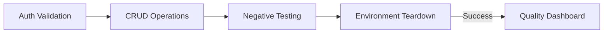

# 🛡️ SecurePay: API & Database Integrity Lab

A specialized SQA automation project designed to validate **API-to-Database persistence** and **transactional integrity**. This lab utilizes a **Grey-Box testing** approach to ensure that high-level API responses accurately reflect the low-level MySQL state.

---

### 📊 Automated Quality Dashboard
This project generates a professional **Newman HTML Dashboard** for every test run, providing real-time visibility into system health.

* **Total Assertions**: 19 automated checks executed in under 2 seconds.
* **Visual Evidence**: Detailed logs of every Request/Response pair, including headers and JSON bodies.
* **Failure Analysis**: Dedicated section for failed tests, showing exactly where the Database logic broke.



---

### 🧪 Advanced Test Scenarios
We implemented five distinct test tiers to ensure total system reliability:

| Tier | Test Type | Objective |
| :--- | :--- | :--- |
| **01** | **Structure & DType** | Validating JSON schema and ensuring MySQL `DECIMAL` types aren't corrupted by the Python "Pipe". |
| **02** | **Data Mapping** | Verifying 1:1 parity between the MySQL "Source of Truth" and the API response. |
| **03** | **Request Chaining** | Using dynamic environment variables to capture balances before and after transactions for mathematical proof. |
| **04** | **Negative & Security** | Stress-testing the API with "Ghost Users," negative amounts, and SQL injection attempts. |
| **05** | **ACID Integrity** | Verifying that the Database correctly triggers a `ROLLBACK` during server crashes (500 errors). |

---

### 📁 Project Structure
* **`/backend`**: Flask API logic with intentional "hidden" bugs.
* **`/database`**: SQL scripts for schema, seeding, and manual integrity checks.
* **`/testing`**: Postman Collections and Environment variables.
* **`/reports`**: Automated HTML test execution dashboards.

---

### 🚦 Getting Started
1.  **Database**: Import `database/schema.sql` and `database/seed_data.sql` into MySQL.
2.  **API**: Run `pip install -r requirements.txt` and start the server with `python backend/main.py`.
3.  **Tests**: Execute the Newman suite:
    ```bash
    newman run testing/Collection.json -e testing/Env.json -r htmlextra --reporter-htmlextra-export reports/Report.html
    ```

### 🔍 Detailed Defect Analysis
To view the specific bugs discovered during this project—including the **Critical Rollback Failure**—please refer to:
👉 **[BUG_REPORTS.md](./BUG_REPORTS.md)**

