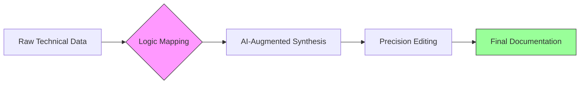

# 🏛️ Documentation Architecture & Strategic Proposals
**Author:** Faizan Ahmed Khan | **Specialization:** AI-Hybrid Ops & Technical Communications  
**Core Objective:** Bridging high-stakes engineering logic and global policy narratives through precision.

---

## 🚀 The Portfolio Vision
This repository serves as a centralized proof-of-logic for technical documentation systems. It demonstrates the transition from complex backend engineering to publication-quality content.

* **Information Architecture:** Structured repository design ensuring seamless navigation across diverse technical domains.
* **Technical Literacy:** Showcasing deep mastery over API automation, SQA, and database integrity.
* **Strategic Narrative:** Engineering high-impact proposals that outperform PhD-level cohorts in global competitions.

---

## 📂 Repository Structure
The following directory architecture reflects a professional approach to technical information management.

* **[01_Strategic_Writing](./01_Strategic_Writing/):** Award-winning scholarship portfolios, global policy essays, and formal grant proposals.
* **[02_Technical_Docs](./02_Technical_Docs/):** Comprehensive SQA reports, API documentation, and industrial standard operating procedures.
* **[03_Research_Analytics](./03_Research_Analytics/):** Peer-reviewed climate variation studies and advanced medical machine learning documentation.
* **[04_Credentials](./04_Credentials/):** Verified international fellowships, academic distinctions, and professional language proficiency certifications.

---

## 🛠️ Technical Workflow (AI-Human Hybrid)
I utilize a sophisticated orchestration of AI and human logic to synthesize data.

## 📬 Contact & Connectivity
Available for high-stakes technical writing, documentation auditing, and strategic proposal architecture.

* **LinkedIn:** [linkedin.com/in/thedatafae](https://linkedin.com/in/thedatafae) 
* **Email:** [fayzank19@yahoo.com](mailto:fayzank19@yahoo.com) 
